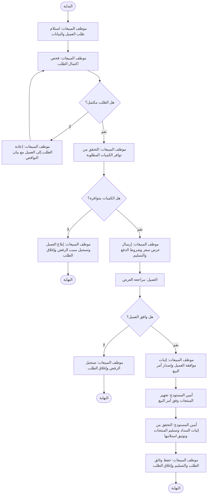

```mermaid
graph TD
    %% تعريف الأشكال والبداية والنهاية
    Start(["البداية"]) --> Sales1["موظف المبيعات: استلام طلب العميل والبيانات"]
    Sales1 --> Sales2["موظف المبيعات: فحص اكتمال الطلب"]
    
    %% نقطة القرار الأولى
    Sales2 --> Check1{"هل الطلب مكتمل؟"}
    Check1 -- لا --> Sales3["موظف المبيعات: إعادة الطلب إلى العميل مع بيان النواقص"]
    Sales3 --> Sales2
    Check1 -- نعم --> Sales4["موظف المبيعات: التحقق من توافر الكميات المطلوبة"]
    
    %% نقطة القرار الثانية
    Sales4 --> Check2{"هل الكميات متوافرة؟"}
    Check2 -- لا --> Sales5["موظف المبيعات: إبلاغ العميل وتسجيل سبب الرفض وإغلاق الطلب"]
    Sales5 --> End1(["النهاية"])
    Check2 -- نعم --> Sales6["موظف المبيعات: إرسال عرض سعر وشروط الدفع والتسليم"]
    
    %% مراجعة العميل
    Sales6 --> Cust1["العميل: مراجعة العرض"]
    Cust1 --> Check3{"هل وافق العميل؟"}
    
    %% نقطة القرار الثالثة
    Check3 -- لا --> Sales7["موظف المبيعات: تسجيل الرفض وإغلاق الطلب"]
    Sales7 --> End2(["النهاية"])
    Check3 -- نعم --> Sales8["موظف المبيعات: إثبات موافقة العميل وإصدار أمر البيع"]
    
    %% المستودع والتسليم
    Sales8 --> Ware1["أمين المستودع: تجهيز المنتجات وفق أمر البيع"]
    Ware1 --> Ware2["أمين المستودع: التحقق من إثبات السداد وتسليم المنتجات وتوثيق استلامها"]
    
    %% الحفظ والإغلاق النهائي
    Ware2 --> Sales9["موظف المبيعات: حفظ وثائق الطلب والتسليم وإغلاق الطلب"]
    Sales9 --> End3(["النهاية"])
```
